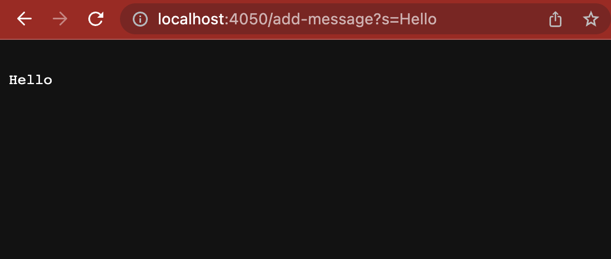
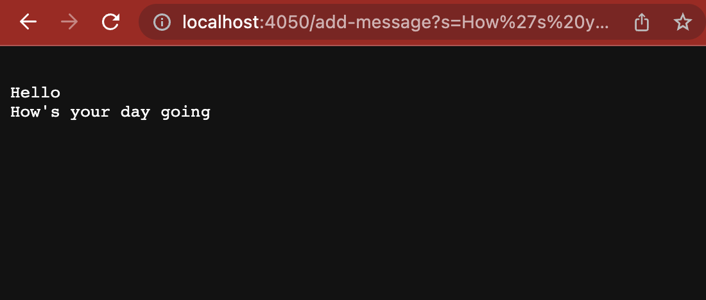
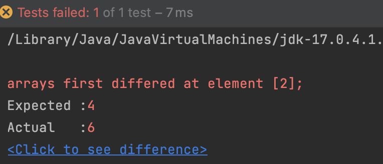

# Part 1

Code for server: 

```
import java.io.IOException;
import java.net.URI;

class Handler implements URLHandler {
   // The one bit of state on the server: a number that will be manipulated by
   // various requests.
   String s = "";

   public String handleRequest(URI url) {
       if (url.getPath().equals("/"))
       {
           return "";
       }
       else{
           System.out.println("Path: " + url.getPath());
           if (url.getPath().contains("/add-message")) {
               String[] parameters = url.getQuery().split("=");
               if (parameters[0].equals("s")) {
                   s += ("\n" + parameters[1]);
                   return s;
               }
           }
           return "404 Not Found!";
       }
   }
}


class StringServer {
   public static void main(String[] args) throws IOException {
       if (args.length == 0) {
           System.out.println("Missing port number! Try any number between 1024 to 49151");
           return;
       }

       int port = Integer.parseInt(args[0]);

       Server.start(port, new Handler());
   }
}

```

Screenshot 1:


Here, the handleRequest method is the one being called. The only parameter that is taken in by this method is the url of the server. However, some of the other values are also modified during this screenshot. There is an array that is used to store the message that the user enters using “add-message”, and that changes to store the string “hello”. The string variable that holds all of the messages is also modified to also include the string “hello”, and it is put on a new line.

Screenshot 2:


Here, the handleRequest method is the one being called. The only parameter that is taken in by this method is the url of the server. However, some of the other values are also modified during this screenshot. There is an array that is used to store the message that the user enters using “add-message”, and that changes to store the string “How’s your day going”. The string variable that holds all of the messages is also modified to also include the string “How’s your day going”, and it is put on a new line. So now the string variables has the string “Hello”, and then on a new line it has “How’s your day going”

## Part 2

Failure-Inducing input:
```
int[] input2 = {4,5,6};
ArrayExamples.reverseInPlace(input2);
assertArrayEquals(new int[]{6,5,4}, input2);
```
Input that doesn't induce a failure:
```
int[] input1 = { 3 };
ArrayExamples.reverseInPlace(input1);
assertArrayEquals(new int[]{ 3 }, input1);
```

The symptom (the output of running the tests) 


Before bug fix code:
```
static void reverseInPlace(int[] arr) {
   for(int i = 0; i < arr.length; i += 1) {
     arr[i] = arr[arr.length - i - 1];
   }
 }
```
After bug fix code:
```
static void reverseInPlace(int[] arr) {
    if(arr == null) {
      return;
    }
    for(int i = 0; i < arr.length/2; i += 1) { //Change the time of iterations
      int temp = arr[i]; //Swap the element, instead of assign
      arr[i] = arr[arr.length - i - 1];
      arr[arr.length - i - 1] = temp;
    }
  }

```

In the original code, it was modifying the first half of the elements fine. But after that, it stopped working, since it would start replacing the later values of the array with the new array values from the first half of the array rather than using the original values. The fix swaps elements from the first and second half of the array rather than simply modifying the array one element at a time to avoid that problem.

### Part 3

One new thing I learned about that was new to me is how running a server works. I felt the numberServer portion to be very interesting as I had never done anything with servers prior to that. Additionally, I learned that the port is used to identify the server itself that is running the code, while the localhost domain is the computer thats being used to run the server.


