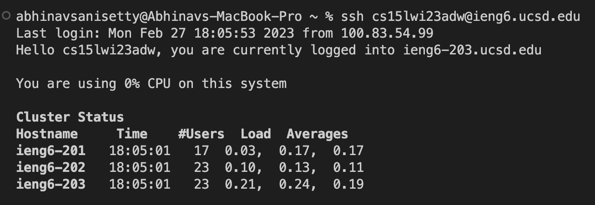
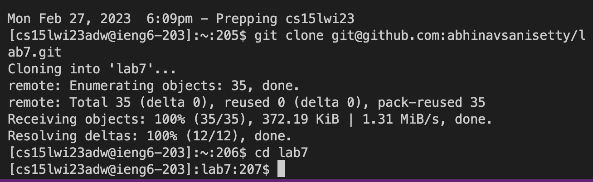
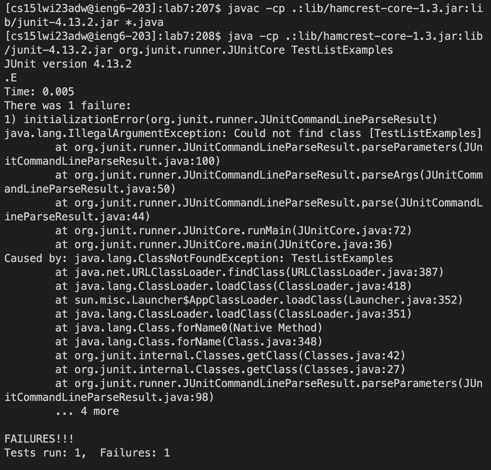
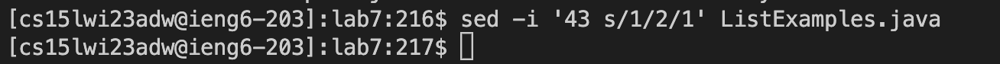
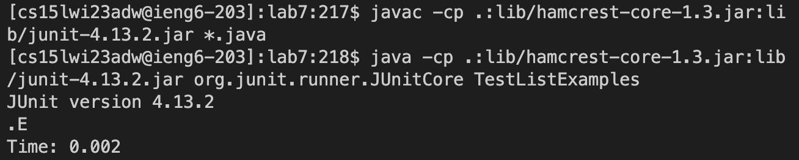
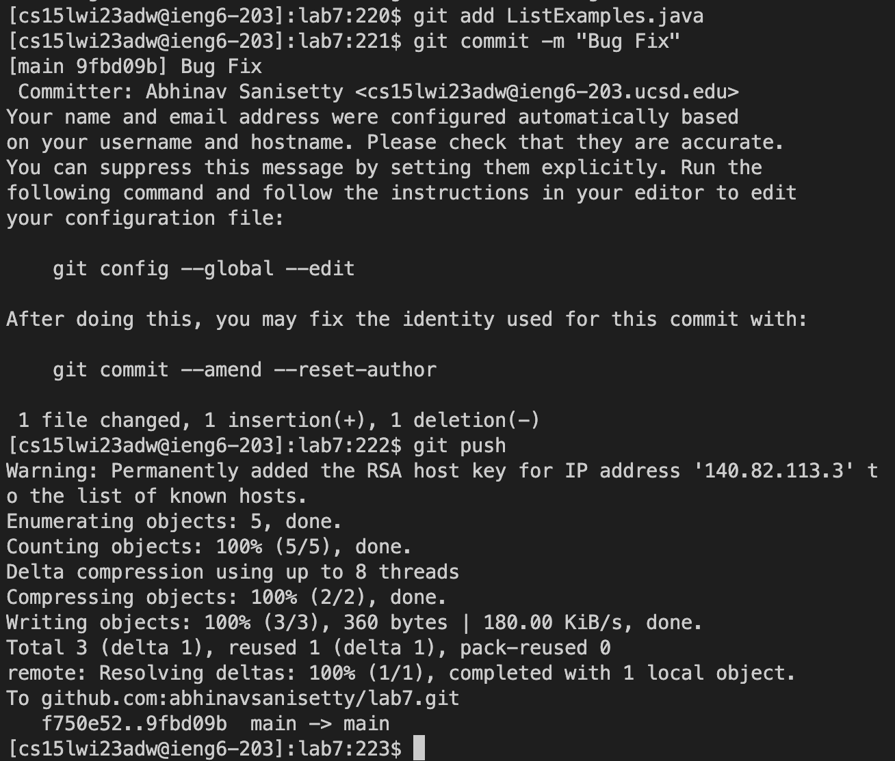

# Lab Report 4

**Step 4**

`ssh cs15lwi23adw@ieng6.ucsd.edu` `<enter>`

The single command used here is to log into the remote desktop. You then have to press `<enter>` to make the command actually run.

**Step 5**

`git clone git@github.com:abhinavsanisetty/lab7.git` `<enter>`

`cd lab7` `<enter>`

The first command is used to clone the repository that I forked to my github account in the setup. The link used is an ssh link instead of the standard HTTPS link. The ssh link is used instead because that way you dont need to login to your account again. The second command is used to switch into the lab7 directory so that I can run the JUnit tests in the next step. I pressed `<enter>` after each command to make the command actually run.

**Step 6**

`<Ctrl + V>` `javac -cp .:lib/hamcrest-core-1.3.jar:lib/junit-4.13.2.jar \*.java` `<enter>`

`<Ctrl + V>` `java -cp .:lib/hamcrest-core-1.3.jar:lib/junit-4.13.2.jar org.junit.runner.JUnitCore TestListExamples` `<enter>`

The first command is used to compile java files, and the second command runs the JUnit tests on them. I copied the commands from the website by using `<Ctrl + C>` on the website and then pressing `<Ctrl + V>` to paste it into the terminal. In the code blocks, I have includes the command to paste what I copied into the terminal, along with the actual command that I pasted into the terminal. I pressed `<enter>` after each to command to make the command actually run. 

**Step 7**

`sed -i ‘43 s/1/2/1’ ListExamples.java` `<enter>`

Here I used the `sed` command to replace the first occurance of "1" with "2" on line 43. Using this command made it so that I did not have to use nano at all and could make the changes in one command, which saved a lot of time.

**Step 8**

`<up>` `<up>` `<enter>`

`<up>` `<up>` `<enter>`

I clicked the up arrow twice and then pressed enter run the command to compile the java files. I then clicked the up arrow twice and pressed enter again to run the command to run the JUnit tests on those files. By using the up arrows, I was able to get the command directly from the bash history rather than typing out the whole thing again, which helped save time.

**Step 9**

`git add ListExamples.java` `<enter>`

`git commit -m “Bug Fix”` `<enter>`

`git push` `<enter>`

Here I first added the changes to set of changes that needs to be committed, I committed the changes, and then I pushed the changes to git to actually update them on the git account.

